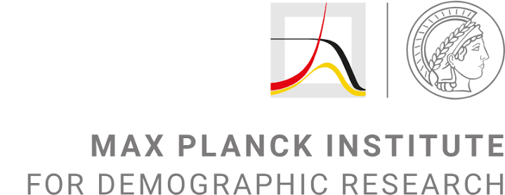

# Técnicas avanzadas de demografía aplicada al estudio de la salud y la población

Bienvenida al sitio del curso **Técnicas avanzadas de demografía aplicada al estudio de la salud y la población**.

Este taller presencial de 15 horas se realizará en **El Colegio de México** del **27 al 31 de julio de 2026**.

## Equipo docente

### [Dr. José Manuel Aburto](https://www.lshtm.ac.uk/aboutus/people/aburto.jose-manuel)

Associate Professor in Demography - Brass Blacker en el Department of Population Health, Faculty of Epidemiology and Population Health, London School of Hygiene & Tropical Medicine. Su investigación se especializa en demografía formal, desigualdades en longevidad y salud poblacional, con trabajo aplicado sobre mortalidad, violencia, COVID-19 y desigualdades en América Latina y otras regiones.

### [Ana Cristina Gómez Ugarte Valerio](https://www.demogr.mpg.de/en/about_us_6113/staff_directory_1899/ana_cristina_gomez_ugarte_valerio_4245/)

Doctoral Student en el Laboratory of Population Dynamics and Sustainable Well-Being del Max Planck Institute for Demographic Research. Su trabajo se centra en la relación entre logro educativo y mortalidad, con investigaciones sobre desigualdades socioeconómicas en mortalidad, medición de desigualdades educativas y aplicaciones a México y otros contextos poblacionales.

## Resumen

El taller introduce herramientas avanzadas de análisis demográfico aplicadas al estudio de la salud y la población, con énfasis en técnicas de descomposición e introducción al *forecasting*. A lo largo de cinco sesiones, las y los participantes aprenderán a separar cambios y diferencias demográficas en componentes atribuibles a edad, estructura poblacional, mortalidad, fecundidad, prevalencias de salud y causas de muerte.

El curso combina fundamentos conceptuales, discusión metodológica y ejercicios prácticos en R, de modo que cada participante pueda implementar los métodos, producir resultados reproducibles e interpretarlos sustantivamente.

## Información general

- **Fechas:** 27 al 31 de julio de 2026
- **Duración:** 15 horas
- **Modalidad:** presencial
- **Sede:** El Colegio de México
- **Cupo:** 15-20 personas

## Estructura del curso

El curso está organizado en cinco sesiones. Cada sesión incluye:

- Slides
- Lab
- Datos
- Lecturas

El código se compartirá al final del curso para favorecer que las y los estudiantes trabajen los ejercicios directamente en R durante las sesiones.

## Materiales destacados

- [Día 1: diapositivas de descomposición de Kitagawa](slides/dia-01-kitagawa.pdf)
- [Día 1: diapositivas de años de vida perdidos](slides/dia-01-years-life-lost.pdf)
- [Día 4: diapositivas de descomposición avanzada](slides/dia-04-descomposicion-avanzada-es.pdf)
- [Día 4: práctica de Venezuela](practicals/dia-04/descomposicion-venezuela/dia-04-descomposicion-venezuela-es.html)
- [Día 4: práctica de México](practicals/dia-04/variacion-longevidad-mexico/dia-04-variacion-longevidad-mexico-es.html)
- [Día 5: diapositivas del método de Lee-Carter](slides/dia-05-lee-carter-es.pdf)
- [Día 5: práctica de modelación y proyección](practicals/dia-05/lee-carter/dia-05-lee-carter-es.html)

## Sesiones

1. [Fundamentos de la descomposición demográfica](sesiones/dia-01-fundamentos-descomposicion.qmd)
2. [Modelación de la mortalidad y descomposición](sesiones/dia-02-tablas-vida-esperanza-vida.qmd)
3. [Salud, prevalencias y esperanza de vida saludable](sesiones/dia-03-salud-sullivan-esperanza-vida-saludable.qmd)
4. [Descomposición avanzada y variación de la longevidad](sesiones/dia-04-metodos-avanzados-robustez.qmd)
5. [Introducción al método de Lee-Carter y su interpretación](sesiones/dia-05-lee-carter-forecasting.qmd)

## Instituciones y financiamiento

::: {.course-logo-panel}
::: {.course-logo-row}
[{fig-alt="London School of Hygiene & Tropical Medicine" .course-logo .course-logo-lshtm}](https://www.lshtm.ac.uk/)

[{fig-alt="Max Planck Institute for Demographic Research" .course-logo .course-logo-mpidr}](https://www.demogr.mpg.de/)

[{fig-alt="Wellcome" .course-logo .course-logo-wellcome}](https://wellcome.org/)
:::
:::
